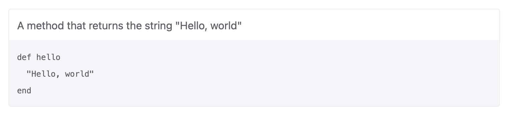

# ✅ AsciiDoc

1.  Install the [`jekyll-asciidoc`] plugin in a local clone of this site,
    then build and serve the site.

1.  Check that the following AsciiDoc sample produces a display corresponding to the appended image.[^1]

```liquid 

.A method that returns the string "Hello, world"
[example]
[source,ruby]
----
def hello
  "Hello, world"
end
----

{{ sample | asciidocify }}
```

|  |

[^1]: The AsciiDoc plugin is not white-listed on GitHub Pages.

[`jekyll-asciidoc`]: https://github.com/asciidoctor/jekyll-asciidoc
