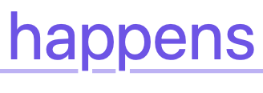

# Links

[A link whose anchor is longer than the line width should break normally
at white space -- this link tests whether that happens or not.](.)

- [A link in an unordered list, whose anchor is longer than the remaining line width,
should break normally at white space -- this link tests whether that happens or not.](.)

Check that when hovering over the above links, the underscore becomes bolder,
and does not intersect the descenders.
The following image illustrates how it should look:

|  |
